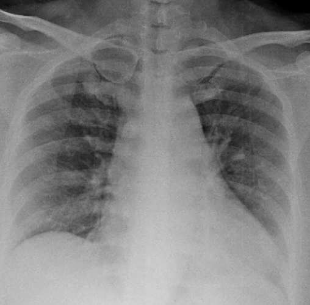
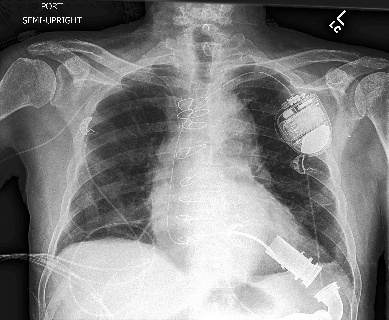
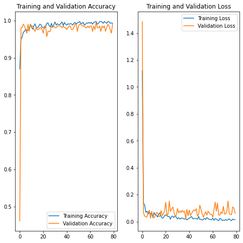
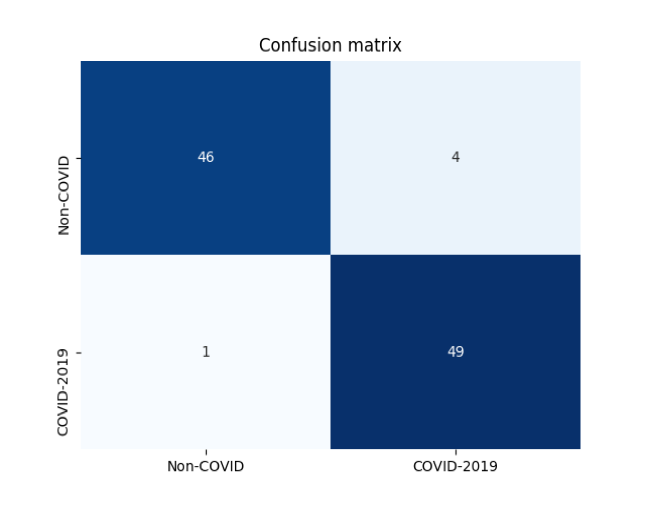

# Covid_detection_CNN

AIRO project: Vision & Perception course

## Approach 
Covid-non Covid detection, with two experiments: RES_NET transfer learning vs custom CNN trained from scratch

## Team
* Flavio Lorenzi 

* Nicolò Mantovani 

* Michele Ciciolla 

## Documentation
dataset and part of the transfer learning work is taken from here :

COVID

NO COVID

## Results 

[]
[]
